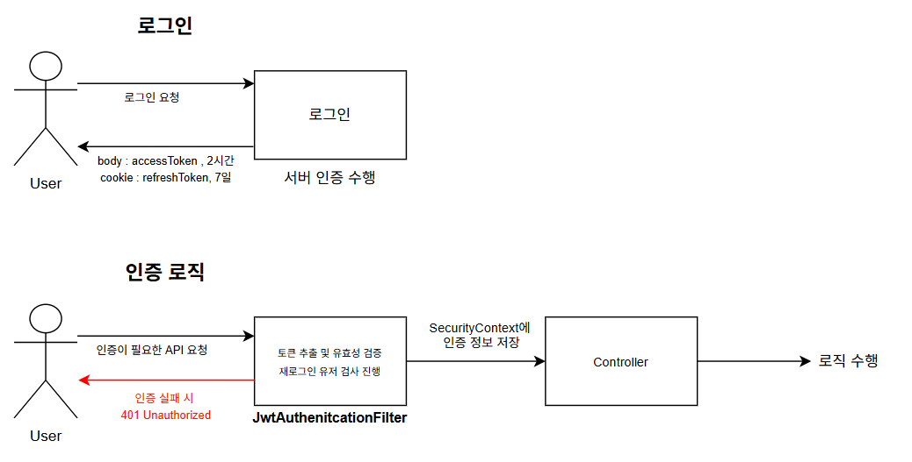

<div align="center">
  <h1>🔐 인증 서비스 (Authentication API)</h1>
  <p>Spring Security + JWT 기반 인증 시스템</p>
  <p><a href="https://authentication.agong.store/swagger-ui/index.html">📗 Swagger API 문서 보기</a></p>
</div>

---

## 📌 프로젝트 개요

- **목적**: 사용자 인증 시스템 구축
- **주요 기능**: 회원가입, 로그인, 토큰 재발급, 로그아웃, 관리자 권한 부여
- **특징**
    - Spring Security + JWT 기반 인증/인가 체계
    - Role 기반 접근 제어 (USER / ADMIN / SUPER_ADMIN)
    - 메모리 기반 저장소 활용 (DB 없이 동작)
    - SpringDoc Swagger로 API 문서 자동 생성

---

## 🌐 배포 주소

- API Server: [https://authentication.agong.store](https://authentication.agong.store)
- Swagger UI: [https://authentication.agong.store/swagger-ui/index.html](https://authentication.agong.store/swagger-ui/index.html)

---

## 🛠 사용 기술 스택

| 기술 | 설명 |
|------|------|
| Java 17 | 개발 언어 |
| Spring Boot 3.4.6 | 프레임워크 |
| Spring Security | 인증/인가 처리 |
| JWT (jjwt) | Access / Refresh 토큰 발급 |
| Swagger (SpringDoc OpenAPI) | API 문서 자동 생성 |
| JUnit5 + MockMvc | 통합 테스트 |

---

## ⚙️ 기능 구성

| 기능 | 설명 |
|------|------|
| 회원가입 | `POST /signup` |
| 로그인 | `POST /login` + JWT 응답 |
| 토큰 재발급 | `POST /reissue` (refreshToken 쿠키 기반) |
| 로그아웃 | `POST /logout` |
| 관리자 권한 부여 | `PATCH /admin/grant` (SUPER_ADMIN만 가능) |
| 강제 재로그인 처리 | 특정 사용자에게 강제 로그아웃 → 재로그인 요구 |

---

## 🔐 인증/인가 구조

- **AccessToken**: Authorization 헤더에 `Bearer {token}` 방식
- **RefreshToken**: 쿠키(`refreshToken`)로 전달 및 저장
- **인가 필터**: JwtAuthenticationFilter + Role 기반 인가 처리
- **로그아웃 및 토큰 무효화**: 저장소에서 RefreshToken 제거
- **강제 재로그인 처리**: 특정 사용자에게 access 차단

---
## 🔐 인증 시스템 흐름

사용자 인증은 Spring Security의 `JwtAuthenticationFilter`를 중심으로 구성되며, 다음과 같은 절차를 따릅니다:

1. **로그인 요청**
    - 사용자가 `/login` 엔드포인트로 `username`, `password`를 담아 로그인 요청을 보냅니다.
    - 서버는 인증 정보를 확인한 후 다음 두 가지 토큰을 발급합니다:
        - **Access Token** (2시간 유효): 응답 바디에 JSON 형태로 반환
        - **Refresh Token** (7일 유효): `HttpOnly` 쿠키에 저장

2. **인증 처리 (보호된 API 요청 시)**
    - 사용자는 보호된 API 호출 시 `Authorization: Bearer <AccessToken>` 형식으로 토큰을 헤더에 포함시켜 요청합니다.
    - 서버는 `JwtAuthenticationFilter`를 통해 Access Token을 검증하고, 성공 시 사용자 정보를 `SecurityContext`에 등록합니다.

3. **강제 재로그인 검사**
    - 인증 필터에서  `ForcedReLoginService`를 통해 해당 사용자가 강제 재로그인 대상인지 확인합니다.
    - 강제 재로그인 대상인 경우, 인증을 거부하고 `401 Unauthorized` 응답과 함께 재로그인을 유도합니다.

4. **Access Token 만료 시 재발급**
    - 사용자는 `/reissue` API에 쿠키에 저장된 Refresh Token을 포함하여 요청합니다.
    - 서버는 저장소(`RefreshTokenRepository`)에 있는 토큰과 비교 및 유효성 검사를 수행한 후, 새로운 Access/Refresh Token을 발급합니다.

5. **로그아웃 처리**
    - `/logout` 요청 시 서버는 `RefreshToken`을 쿠키에서 제거하고 저장소에서도 삭제하여 재사용을 방지합니다.

---

### 🗂 구성 요소 요약

| 구성 요소 | 설명 |
|-----------|------|
| `JwtAuthenticationFilter` | 토큰 검증 및 인증 처리 필터 |
| `JwtTokenProvider` | 토큰 생성, 파싱, 유효성 검사 유틸리티 |
| `RefreshTokenRepository` | 서버에 저장된 RefreshToken 관리 (In-Memory) |
| `ForcedReLoginRepository` | 강제 재로그인 대상자 목록 저장 (In-Memory) |
| `SecurityContext` | 인증된 사용자 정보 저장소 (Spring Security 기본 제공) |

---
## 📁 주요 디렉토리 구조
```
📦src
┣ 📂main
┃ ┣ 📂java
┃ ┃ ┗ 📂store.agong.authentication
┃ ┃ ┣ 📂domain
┃ ┃ ┃ ┣ 📂user
┃ ┃ ┃ ┃ ┣ 📂controller # 회원가입, 로그인, 관리자 권한 API
┃ ┃ ┃ ┃ ┣ 📂dto # 서비스 계층 내부에서 사용하는 DTO
┃ ┃ ┃ ┃ ┣ 📂entity # User, Role, BaseEntity
┃ ┃ ┃ ┃ ┣ 📂request # API 요청 DTO
┃ ┃ ┃ ┃ ┣ 📂response # API 응답 DTO
┃ ┃ ┃ ┃ ┣ 📂service # 회원가입, 로그인, 로그아웃, 권한 부여 서비스
┃ ┃ ┃ ┃ ┗ 📂repository # InMemoryUserRepository, 인터페이스
┃ ┃ ┃ ┗ 📂forcedReLogin
┃ ┃ ┃ ┣ 📂repository # 강제 재로그인 사용자 저장소 (인터페이스 + 구현체)
┃ ┃ ┃ ┗ 📂service # 강제 재로그인 판단 로직
┃ ┃ ┣ 📂global
┃ ┃ ┃ ┣ 📂config # SecurityConfig, CORS 등 전역 설정
┃ ┃ ┃ ┣ 📂exception # BaseException, ExceptionHandler
┃ ┃ ┃ ┣ 📂jwt
┃ ┃ ┃ ┃ ┣ 📂filter # JwtAuthenticationFilter
┃ ┃ ┃ ┃ ┣ 📂provider # JwtTokenProvider
┃ ┃ ┃ ┃ ┗ 📂repository # RefreshTokenRepository (in-memory)
┃ ┃ ┃ ┗ 📂util # 쿠키 생성등 보조 도구
┃ ┣ 📂resources
┃ ┃ ┗ 📄application.yml # JWT 설정 포함
┗ 📂test
    ┗ 📂store.agong.authentication
        ┣ 📂domain.user.controller # 회원가입, 로그인, 로그아웃, 토큰 재발급 테스트
        ┗ 📂domain.forcedReLogin # 강제 재로그인 필터 테스트
        ┗ 📂domain.amdin.controller # 관리자 권한 부여  테스트
```